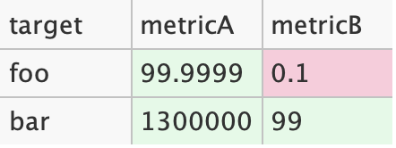

= lowtable

Super simple swing component to render tables.

== Installation
Add `com.mayreh.lowtable:lowtable:$VERSION` to the dependency.

== Usage

[source,java]
----
TableData data = TableData
        .builder()
        .header("target", "metricA", "metricB")
        .addRow(Cell.of("foo"),
                Cell.of("99.9999", styler -> styler.background(Defaults.SUCCESS_LIGHT)),
                Cell.of("0.1", styler -> styler.background(Defaults.DANGER_LIGHT)))
        .addRow(Cell.of("bar"),
                Cell.of("1300000", styler -> styler.background(Defaults.SUCCESS_LIGHT)),
                Cell.of("99", styler -> styler.background(Defaults.SUCCESS_LIGHT)))
        .build();

Table table = new Table(TableStyle.DEFAULT, data);
table.setAutoSize();
table.saveAsPNG(file);
----
